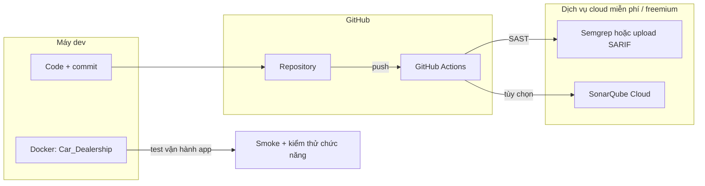

# Kiến trúc tối ưu không thuê server + mẫu GitHub Actions

Bản lưu tài liệu kế hoạch (để đính kèm repo hoặc báo cáo). Triển khai tương ứng nằm trong repo: `.github/workflows/security-ci.yml`, `sonarcloud.yml`, `juice-shop-smoke.yml`, `sonar-project.properties`, `Car_Dealership/`.

## Luồng tổng quan

- **Không cần VPS**: runner do GitHub host; Semgrep chạy trong job; Sonar dùng [SonarQube Cloud](https://www.sonarsource.com/products/sonarcloud/) (free cho public repo, private theo policy Sonar).
- **Car_Dealership**: chạy trực tiếp bằng **Docker** từ mã nguồn trong repo để có minh chứng vận hành ứng dụng thật cả local và CI.

## Cấu trúc file trong repo

| Thành phần | Vai trò |
|------------|--------|
| [`.github/workflows/security-ci.yml`](../.github/workflows/security-ci.yml) | Push/PR: cài Semgrep CLI hoặc `returntocorp/semgrep-action`, quét thư mục mã nguồn, xuất log + (tùy chọn) SARIF lên GitHub Code Scanning |
| [`.github/workflows/sonarcloud.yml`](../.github/workflows/sonarcloud.yml) | SonarCloud scan: secret `SONAR_TOKEN`; `sonar.organization` / `sonar.projectKey` trong `sonar-project.properties` |
| [`sonar-project.properties`](../sonar-project.properties) (gốc repo) | Cấu hình nguồn, exclusions — bắt buộc cho SonarCloud CLI |
| [`.github/workflows/juice-shop-smoke.yml`](../.github/workflows/juice-shop-smoke.yml) | Build Docker image Car_Dealership + run container + smoke test HTTP |
| Tài liệu trong báo cáo | Ảnh chụp tab Actions, đoạn log, số finding, thời gian job; hướng dẫn chạy local `cd Car_Dealership && docker compose up --build` |

## Nội dung kỹ thuật cốt lõi

**1. Semgrep (SAST trên code của bạn)**

- Cách phổ biến: `pip install semgrep` rồi `semgrep scan --config auto --error` hoặc rules OWASP/custom.
- Để có **bảng lỗi trên GitHub**: bật Code Scanning với upload SARIF (`actions/upload-sarif`) — repo public thường đủ; private cần GitHub Advanced Security (tùy gói). Nếu không có SARIF, vẫn **đủ điểm** với log job và exit code.

**2. SonarQube Cloud**

- Tạo project trên SonarCloud, lấy token, thêm secrets vào repo.
- Workflow dùng official action `SonarSource/sonarqube-scan-action` (hoặc scanner cũ tùy doc hiện tại) + `sonar-project.properties`.

**3. Car_Dealership Docker smoke**

- **Local**: `cd Car_Dealership && docker compose up --build`.
- **CI**: build image bằng `docker build`, chạy container `-p 8080:8080`, sau đó `curl http://localhost:8080/` để smoke test.

## Thứ tự triển khai gợi ý

1. Khởi tạo repo, đẩy mã (hoặc project mẫu nhỏ).
2. Thêm workflow Semgrep trước (nhanh, ít secret).
3. Kết nối SonarCloud nếu giáo trình yêu cầu “phân tích chất lượng/SAST tích hợp nền tảng”.
4. Car_Dealership: chạy Docker local + bắt buộc giữ job smoke trong Actions để chứng minh app vận hành được trên CI.

## Lưu ý tránh hiểu nhầm khi viết báo cáo

- **Semgrep/Sonar trên repo của bạn** = phân tích **mã bạn commit**, còn smoke test Docker chỉ xác nhận app Car_Dealership khởi chạy và phản hồi HTTP.
- **Private repo**: phút Actions theo quota GitHub; SonarCloud/Semgrep theo điều khoản từng dịch vụ.

## Phạm vi triển khai (đã làm trong repo)

- Thư mục `.github/workflows/` với workflow Semgrep, SonarCloud, và job Car_Dealership smoke (build + run + healthcheck).
- File `sonar-project.properties` mẫu (placeholder keys — cần thay bằng org/project SonarCloud thật và thêm `SONAR_TOKEN`).
